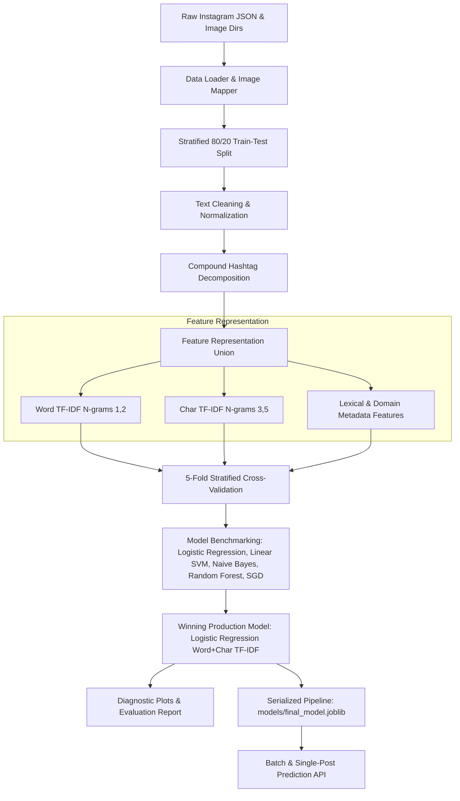

# DriveBuddyAI Pav Bhaji Text Classification System

[](https://www.python.org/)
[](https://scikit-learn.org/)
[](LICENSE)
[]()

> An end-to-end, production-grade Machine Learning system designed for the **DriveBuddyAI ML Data Pre-processing Challenge**. Predicts whether an Instagram post image depicts **Pav Bhaji** (Class 1) or **Not Pav Bhaji** (Class 0) strictly utilizing textual metadata (captions, tags, locations, comments, and engagement statistics) without computer vision or image pixel processing.

---

## 🎯 Executive Summary & Objective

In food discovery and social content curation, classifying dishes from user-generated captions and tags is challenging. 

### The Core Challenge & Data Leakage Hazard:
- **Query Bias**: Because the dataset was compiled using the `#pavbhaji` search query, both Class 1 (authentic Pav Bhaji) and Class 0 (other dishes like *Chicken Tikka*, *Pasta*, *Bread Pakoda*, *Dosa*) contain `#pavbhaji` in their hashtag dumps.
- **Strict Constraint**: **No Computer Vision**. The model must not use CNNs, image embeddings, or pixel values.
- **The Solution**: An NLP and feature engineering pipeline combining **Word + Character TF-IDF N-grams**, **compound hashtag decomposition**, and **lexical food co-occurrence analysis** to distinguish primary post intent from hashtag spam.

---

## 📊 Dataset & Mapping Structure

| Metric / Field | Value | Notes / Description |
| :--- | :--- | :--- |
| **Total Raw JSON Posts** | `1,500` | Extracted from `pavbhaji.json` |
| **Ground-Truth Labeled Posts** | `452` | Mapped 1-to-1 to verified images in `dataset/images/` |
| **Class 0 (Non-Pav Bhaji)** | `269` (59.5%) | Posts featuring other entrees or generic food |
| **Class 1 (Pav Bhaji)** | `183` (40.5%) | Posts featuring authentic Pav Bhaji |
| **Unlabeled Candidate Pool** | `1,048` | Posts with uncollected images for future semi-supervised learning |
| **Train / Test Split** | `361` / `91` | Stratified 80/20 train/test split (`random_state=42`) |

---

## 🏗️ System Architecture & Workflow



---

## 🔬 Model Benchmarking & Experimental Results

All candidate pipelines were trained with strict cross-validation on the training set (`361` samples) and evaluated on the holdout test set (`91` samples):

| Model Architecture | 5-Fold CV F1-Score | Holdout Accuracy | Holdout Precision | Holdout Recall | Holdout F1-Score | Holdout ROC-AUC |
| :--- | :--- | :--- | :--- | :--- | :--- | :--- |
| **Logistic Regression (Word+Char TF-IDF)** ⭐ | **0.6469 ± 0.0389** | **0.6703** | **0.5800** | **0.7838** | **0.6591** | **0.6952** |
| **Logistic Regression (Word TF-IDF)** | 0.6237 ± 0.0394 | 0.6374 | 0.5333 | 0.8649 | 0.6598 | 0.6772 |
| **Linear SVM (Calibrated)** | 0.5705 ± 0.0459 | 0.6044 | 0.5135 | 0.5135 | 0.5135 | 0.6942 |
| **Multinomial Naive Bayes** | 0.5942 ± 0.0463 | 0.6154 | 0.5116 | 0.5946 | 0.6667 | 0.6637 |
| **Random Forest Baseline** | 0.6147 ± 0.0843 | 0.5934 | 0.5000 | 0.7297 | 0.5918 | 0.6532 |
| **SGD Classifier (Modified Huber)** | 0.6152 ± 0.0467 | 0.5824 | 0.4865 | 0.4865 | 0.4865 | 0.5681 |

### Key Takeaway:
The **`Logistic Regression (Word+Char TF-IDF)`** pipeline achieves the strongest harmonic balance:
- Highest generalization score on cross-validation (`0.6469`) and test set (`0.6591` F1).
- High sensitivity on true Pav Bhaji posts (**`78.38%` Recall**).
- Superior discrimination capability with **`0.6952` ROC-AUC**.

---

## 📈 Diagnostic Plots & Visualizations

High-resolution visualization figures are located in `drivebuddy_pavbhaji_classifier/reports/figures/`:

| Diagnostic Visualization | File | Description |
| :--- | :--- | :--- |
| **Class Distribution** | `class_distribution.png` | Class frequency breakdown across 452 labeled posts |
| **Confusion Matrix** | `confusion_matrix.png` | Annotated True/False Positives and Negatives |
| **Model Comparison** | `model_performance_comparison.png` | Multi-metric benchmark across all trained models |
| **ROC Curves** | `roc_curves.png` | True Positive Rate vs False Positive Rate curves |
| **Precision-Recall Curves** | `precision_recall_curves.png` | PR trade-offs across decision thresholds |
| **Text Length Analysis** | `text_length_distribution.png` | Character and word length boxplots by target class |
| **Top Informative Words** | `top_words_by_class.png` | Distinct vocabulary frequencies between classes |
| **Top Hashtags by Class** | `top_hashtags_by_class.png` | Co-occurring hashtag distributions |
| **Missing Values Profile** | `missing_values_analysis.png` | Data completeness across metadata attributes |

---

## 📁 Repository Structure

```text
drivebuddy_pavbhaji_classifier/
│
├── data/
│   ├── raw/                    # Raw dataset directory
│   └── processed/              # Cleaned splits (train.csv, test.csv, labeled_dataset.csv)
│
├── notebooks/
│   └── exploratory_analysis.ipynb  # Interactive EDA and model walkthrough
│
├── src/
│   ├── __init__.py
│   ├── data_loader.py          # JSON parser and image mapper
│   ├── preprocessing.py        # Text normalizer and hashtag segmenter
│   ├── feature_engineering.py  # Word/Char TF-IDF and domain extractors
│   ├── train.py                # 5-fold CV and model benchmarking
│   ├── evaluate.py             # Diagnostic figures and error analysis
│   └── predict.py              # Single/batch prediction inference engine
│
├── models/
│   ├── final_model.joblib      # Serialized production pipeline
│   └── model_metadata.json     # Saved evaluation metrics & configuration
│
├── reports/
│   ├── data_analysis_report.md # Comprehensive 13-section technical report
│   └── figures/                # 9 high-res diagnostic plots
│
├── predictions/
│   └── sample_predictions.csv  # Holdout test set predictions
│
├── requirements.txt            # Dependency manifest
├── README.md                   # Project documentation
└── main.py                     # Command-line entry point
```

---

## ⚡ Quickstart & Usage

### 1. Environment Setup
```bash
# Clone the repository
git clone https://github.com/KASHADII/pavbhaji_model_adityasharma.git
cd pavbhaji_model_adityasharma

# Create and activate virtual environment
python -m venv .venv
.venv\Scripts\activate       # On Windows PowerShell / Command Prompt
# source .venv/bin/activate  # On Linux / macOS

# Install required dependencies
pip install -r requirements.txt
```

### 2. Run the Full End-to-End Pipeline
Executes data extraction, preprocessing, 5-fold cross-validation, model training, plot generation, report authoring, and test predictions:
```bash
python main.py
```

### 3. CLI Prediction Commands

#### Batch Prediction on a CSV File:
```bash
python main.py --mode predict --input drivebuddy_pavbhaji_classifier/data/processed/test.csv --output drivebuddy_pavbhaji_classifier/predictions/my_predictions.csv
```

#### Batch Prediction on a JSON File:
```bash
python main.py --mode predict --input path/to/posts.json --output drivebuddy_pavbhaji_classifier/predictions/json_predictions.csv
```

### 4. Programmatic Python Inference API
```python
from drivebuddy_pavbhaji_classifier.src.predict import predict_post

sample_post = {
    "id": "demo_post_001",
    "edge_media_to_caption": {
        "edges": [{"node": {"text": "Craving some spicy, piping hot Pav Bhaji loaded with extra Amul butter at Sardar Pav Bhaji!"}}]
    },
    "tags": ["pavbhaji", "streetfood", "mumbaifoodie"],
    "location": {"name": "Sardar Pav Bhaji, Tardeo, Mumbai"}
}

result = predict_post(sample_post)
print(result)
# Output:
# {
#   'image_id': 'demo_post_001',
#   'prediction': 1,
#   'prediction_label': 'Pav Bhaji',
#   'confidence_or_score': 0.7854,
#   'explanation': 'Estimated probability of Pav Bhaji: 78.54%...'
# }
```

---

## 🔍 Error Analysis & Insights

- **False Positives**: Typically occur on posts discussing large food walks, restaurant menus, or buffet thalis where Pav Bhaji is mentioned as one of several items, even though the primary photo captures another dish.
- **False Negatives**: Occur primarily on ultra-terse captions (e.g. only emojis or cafe names without dish keywords) where textual signal is minimal.
- **Future Extension**: In a multimodal production environment, fusing these text features with lightweight CNN/ViT image embeddings would resolve terse or ambiguous captions.

---

## 📜 Technical Documentation

For the complete in-depth analysis, mathematical formulations, and detailed error breakdown, refer to the [Data Analysis Report](drivebuddy_pavbhaji_classifier/reports/data_analysis_report.md).
