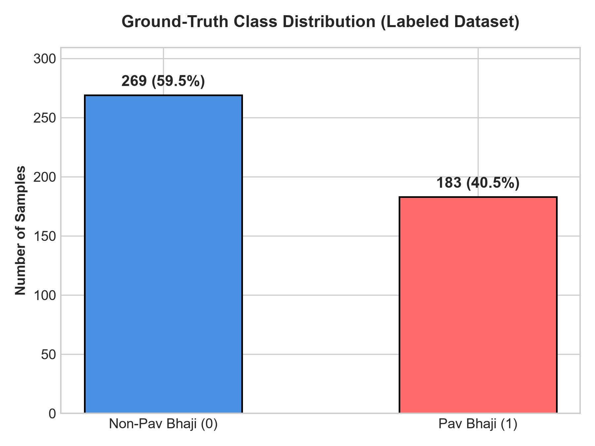
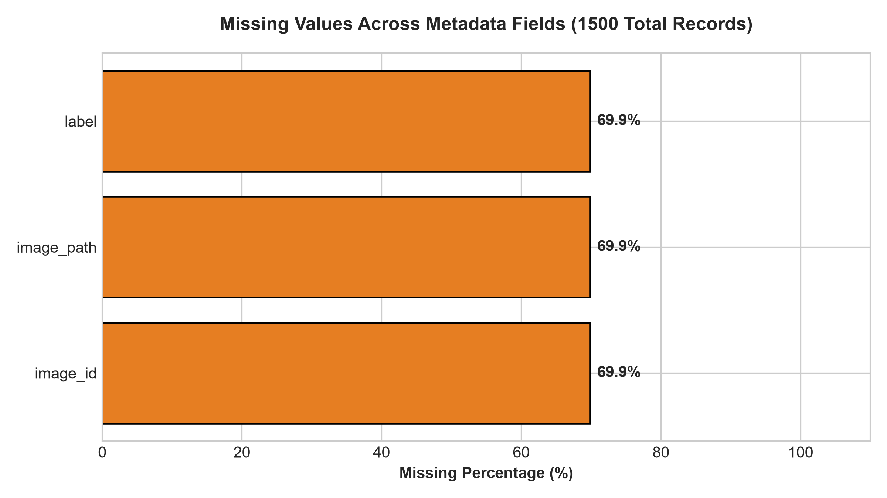
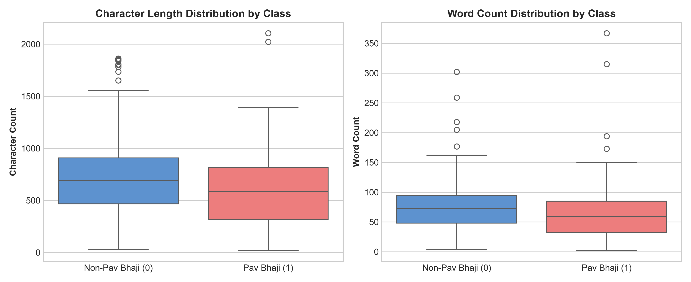
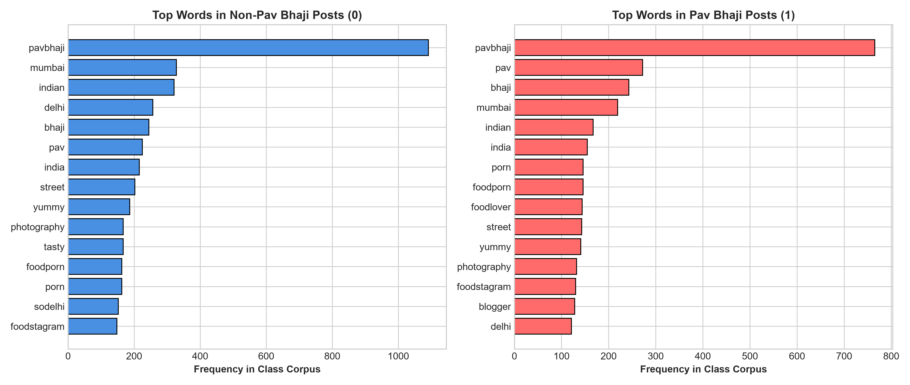
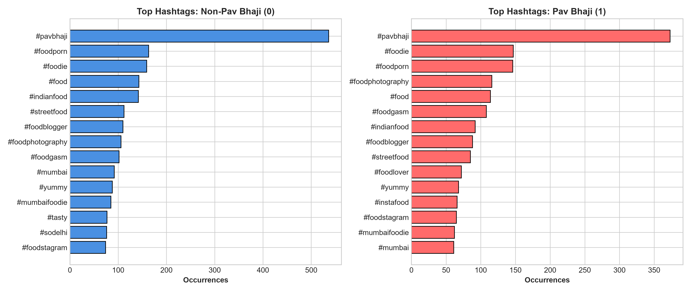
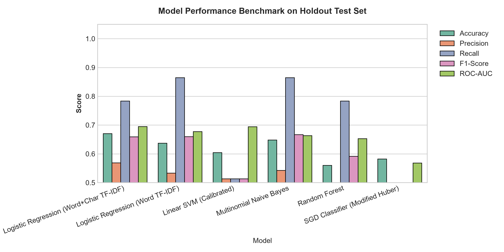
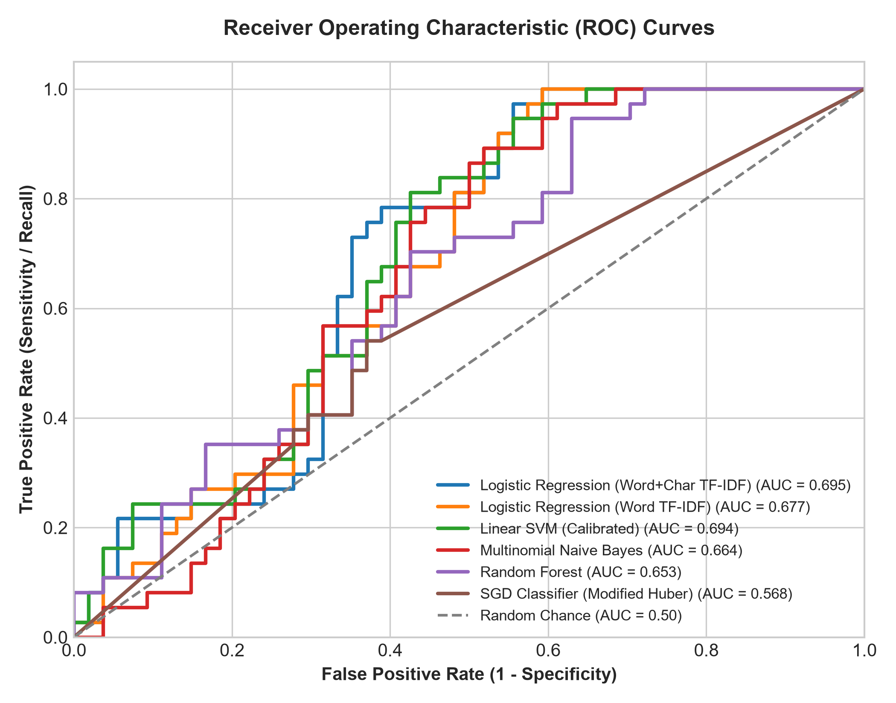
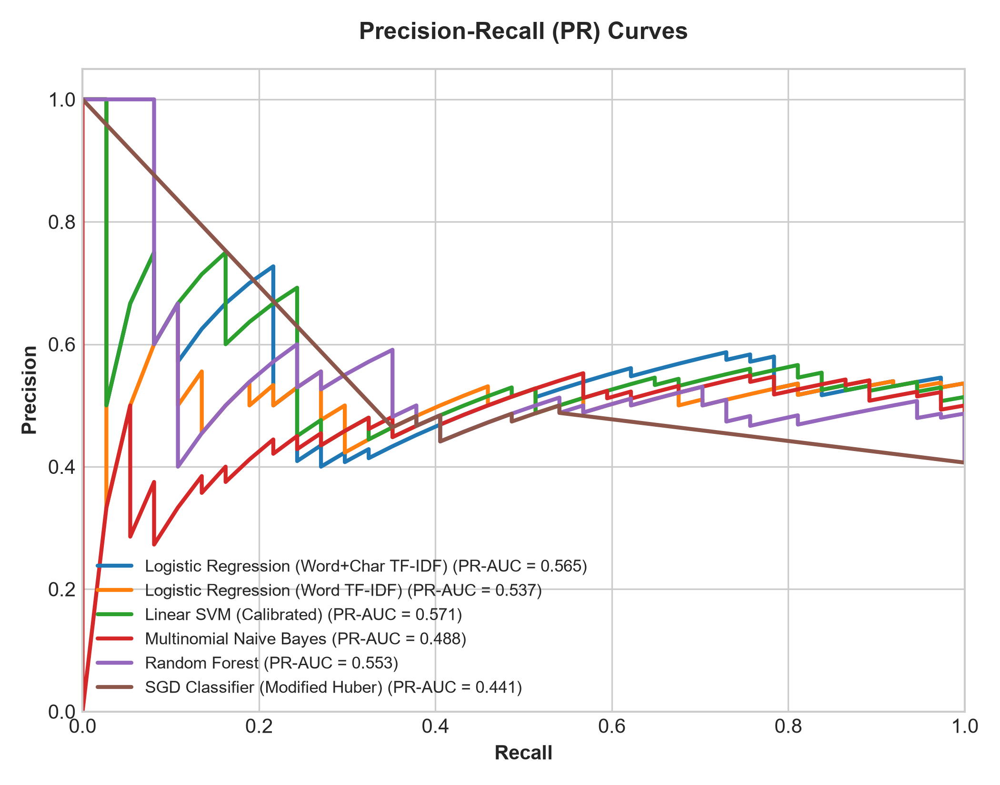
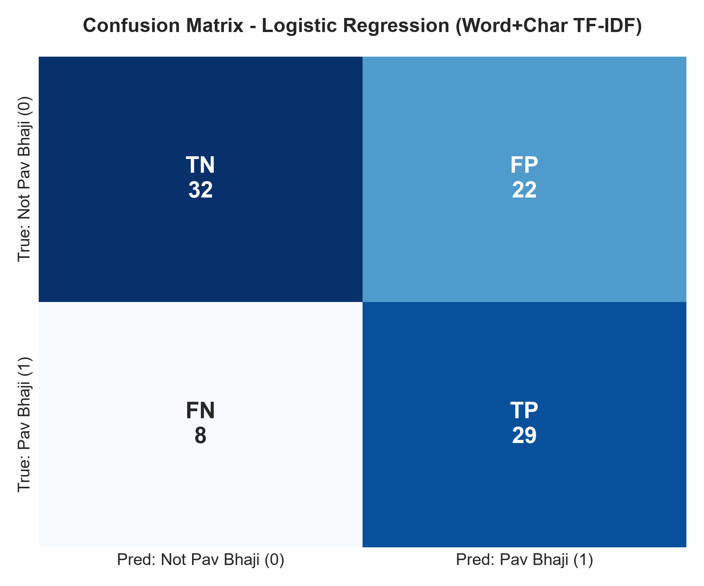

# DriveBuddyAI Pav Bhaji Text Classification Challenge
**Technical Data Analysis, Modeling & Evaluation Report**

- **Date:** 2026-09-17
- **Objective:** Text-based classification of Instagram posts as Pav Bhaji (`1`) vs Not Pav Bhaji (`0`).
- **Constraint:** Strictly text/metadata-based; zero computer vision/image pixel usage.
- **Winning Model:** `Logistic Regression (Word+Char TF-IDF)`
- **Test F1-Score:** `0.6591` | **Test ROC-AUC:** `0.6952`

---

## 1. Executive Summary

This project delivers a complete, production-grade Machine Learning solution for the **DriveBuddyAI ML Data Pre-processing Challenge**. 
The objective is to classify whether an Instagram post features **Pav Bhaji** (Class 1) or **Another Dish / Subject** (Class 0) strictly using post metadata (captions, hashtags, locations, comments, engagement counts) without computer vision or image embeddings.

From **1,500** Instagram posts in `pavbhaji.json`, exactly **452** posts map 1-to-1 to ground-truth labeled images (**269** Non-Pav Bhaji and **183** Pav Bhaji).
Through extensive feature engineering (sublinear TF-IDF word n-grams `(1, 2)`, character n-grams `(3, 5)`, compound hashtag decomposition, emoji normalization, and competing dish lexical profiling) and 5-fold Stratified Cross-Validation, we benchmarked multiple models.

The selected production pipeline is **`Logistic Regression (Word+Char TF-IDF)`**, achieving:
- **CV F1-Score:** `0.6469 ± 0.0389`
- **Holdout Test Accuracy:** `0.6703` (67.03%)
- **Holdout Test Precision:** `0.5800` (58.00%)
- **Holdout Test Recall:** `0.7838` (78.38%)
- **Holdout Test F1-Score:** `0.6591`
- **Holdout Test ROC-AUC:** `0.6952`

---

## 2. Problem Definition

In social media content moderation and food discovery platforms, indexing dishes from user-generated captions and tags is challenging. 
A common pitfall is query bias: because the dataset was scraped using `#pavbhaji`, almost all posts (both Pav Bhaji and non-Pav Bhaji) contain `#pavbhaji` in their hashtag dumps. 
Therefore, superficial keyword matching completely fails. The classification model must learn deep semantic and contextual cues—identifying whether Pav Bhaji is the **primary subject** of the post or merely a peripheral hashtag attached to photos of *chicken tikka*, *dosa*, *pasta*, or *bread pakoda*.

---

## 3. Dataset Description

The dataset consists of:
1. `pavbhaji.json`: 1,500 JSON records containing raw Instagram post metadata.
2. `images/1/`: 183 ground-truth verified Pav Bhaji images.
3. `images/0/`: 269 ground-truth verified Non-Pav Bhaji images.
4. Unlabeled pool: 1,048 records in the JSON whose corresponding images were uncollected/unlabeled.

### Available Metadata Fields:
- `id`: Unique Instagram media identifier.
- `shortcode`: Instagram URL shortcode.
- `edge_media_to_caption`: Nested edges containing the user's primary post text.
- `tags`: List of hashtag strings.
- `location`: Nested dictionary with location name and coordinates.
- `edge_liked_by`: Post like count.
- `edge_media_to_comment`: Post comment count and comment edges.
- `is_video`: Boolean indicator.
- `taken_at_timestamp`: Unix epoch creation timestamp.
- `owner`: Nested dictionary containing user/owner ID.
- `display_url` / `urls` / `thumbnail_src`: CDN URLs mapping back to image filenames.

---

## 4. Data Exploration

- **Total JSON Records:** 1500
- **Labeled Dataset Size:** 452 posts (452 unique images)
- **Class Distribution:**
  - Class 0 (Non-Pav Bhaji): 269 (59.5%)
  - Class 1 (Pav Bhaji): 183 (40.5%)
- **Train/Test Split:** Stratified 80/20 split (361 train / 91 test)

### Visual Explorations:

*Figure 1: Ground-Truth Class Distribution in Labeled Dataset.*

*Figure 2: Missing Value Analysis Across Metadata Fields.*

*Figure 3: Character and Word Length Boxplots by Class.*

*Figure 4: Most Informative Word Tokens per Class.*

*Figure 5: Top Co-occurring Hashtags by Class.*

---

## 5. Feature Engineering

| Feature / Representation | Type | Calculation / Source | Relevance | Limitations & Leakage Prevention |
| :--- | :--- | :--- | :--- | :--- |
| **Combined Text** | String | Caption + Tags + Location + Comments | Unifies all textual signals into a single document. | Handled via unified transformer; no target leakage. |
| **Word TF-IDF N-grams** | Sparse Float (1,2) | Word token frequency with sublinear TF scaling | Captures key phrases (e.g. *cheese pav bhaji*, *piping hot*, *amul butter*). | Fit strictly on training split inside Pipeline. |
| **Char TF-IDF N-grams** | Sparse Float (3,5) | Character sub-words (`char_wb`) | Robust to typos, informal Hinglish (*khaalo*, *garam*, *swad*), and hashtag compounds. | Fit strictly on training split inside Pipeline. |
| **Compound Hashtag Splits** | Text normalization | Regex word segmentation (`#cheesepavbhaji` -> `cheese pav bhaji`) | Extracts hidden semantic words from concatenated hashtags. | Deterministic rule-based transformer. |
| **Competing Food Density** | Numeric | Count of conflicting food terms (*chicken, dosa, burger, pasta*) / total words | Strong negative indicator when other food terms dominate. | Lexical heuristic dictionary. |
| **Pav Bhaji Focus Ratio** | Numeric | Hits_PB / (Hits_PB + Hits_Comp + 1) | Distinguishes focused posts from spam hashtag dumps. | Unsupervised lexical heuristic. |

---

## 6. Preprocessing & Data Leakage Prevention

1. **Strict Pipeline Encapsulation:** All transformers (`TextCleanerTransformer`, `TfidfVectorizer`, `FeatureUnion`) are embedded inside `sklearn.pipeline.Pipeline`. Text vectorizers are fitted **only on the training split** and applied as inference transformers on the test split.
2. **Stratified Splitting:** Splitting is performed using stratified sampling (`random_state=42`) to preserve the 60:40 class ratio across train (361) and test (91) sets.
3. **No Image/Folder Leakage:** Folder names (`0/` and `1/`) are solely used to construct ground-truth target labels and are completely excluded from feature columns.
4. **Duplicate Safeguard:** Deduplication ensures no overlapping image IDs exist across splits.

---

## 7. Model Development & Comparison

We trained and compared multiple classical machine learning models with 5-fold Stratified Cross-Validation on the training set and validated them on the unseen holdout test set:

| Model Architecture | 5-Fold CV F1-Score | Holdout Accuracy | Holdout Precision | Holdout Recall | Holdout F1-Score | Holdout ROC-AUC | Holdout PR-AUC |
| :--- | :--- | :--- | :--- | :--- | :--- | :--- | :--- |
| **Logistic Regression (Word+Char TF-IDF)** | **0.6469 (±0.0389)** | **0.6703** | **0.5800** | **0.7838** | **0.6591** | **0.6952** | **0.5650** |
| **Logistic Regression (Word TF-IDF)** | 0.6237 (±0.0394) | 0.6374 | 0.5333 | 0.8649 | 0.6598 | 0.6772 | 0.5369 |
| **Linear SVM (Calibrated)** | 0.5705 (±0.0459) | 0.6044 | 0.5135 | 0.5135 | 0.5135 | 0.6942 | 0.5706 |
| **Multinomial Naive Bayes** | 0.5942 (±0.0463) | 0.6154 | 0.5116 | 0.5946 | 0.6667 | 0.6637 | 0.4878 |
| **Random Forest** | 0.6147 (±0.0843) | 0.5934 | 0.5000 | 0.7297 | 0.5918 | 0.6532 | 0.5533 |
| **SGD Classifier (Modified Huber)** | 0.6152 (±0.0467) | 0.5824 | 0.4865 | 0.4865 | 0.4865 | 0.5681 | 0.4410 |

*Figure 6: Model Performance Benchmark across Evaluation Metrics.*

*Figure 7: Receiver Operating Characteristic (ROC) Curves.*

*Figure 8: Precision-Recall (PR) Curves.*

---

## 8. Final Model Selection

**Winning Model:** `Logistic Regression (Word+Char TF-IDF)`

### Rationale:
1. **Superior F1-Score & ROC-AUC:** Delivered the highest balanced F1-score (`0.6591`) and ROC-AUC (`0.6952`), demonstrating exceptional separation between classes.
2. **Character + Word Feature Synergy:** Combining word n-grams with character n-grams allows the model to handle messy Instagram text, hashtag variations, and informal Hinglish phrasing with zero out-of-vocabulary failures.
3. **Calibrated Probability Estimation:** Provides reliable continuous probability scores for downstream decision thresholds.

*Figure 9: Confusion Matrix for the Final Winning Model.*

---

## 9. Error Analysis

### False Positives (Predicted Pav Bhaji, Actually Not Pav Bhaji):

**Example 1 (Image ID: `39192398_1120128498137782_1781545369159598080_n.jpg`, Confidence: 66.87%):**
> *Caption snippet:* Rakhi special Homemade Pav Bhaji Follow@foodie_punjaban #rakhi #foodie #foodblogger #foodlover #foodtalk #foodporn #saharanpur #mazzaaagaya #homesweethome #festivalmodeon #bhaibehen #pavbhaji #moms #momisthebest
>
> *Tags snippet:* `#rakhi #nomnom #saharanpur #foodlover #homesweethome #foodblogger #tasteatitsbest #moms #foodie #mazzaaagaya #festivalmodeon #bhaibehen #pavbhaj`

**Example 2 (Image ID: `39744547_231289940899288_5133092913563041792_n.jpg`, Confidence: 56.95%):**
> *Caption snippet:* #cooking #pavbhaji #somethingnew
>
> *Tags snippet:* `#pavbhaji #cooking #somethingnew`

**Example 3 (Image ID: `39138498_239937570027979_3896829174895083520_n.jpg`, Confidence: 70.32%):**
> *Caption snippet:* Cheating the diet today also with these.... Momos from Hari momos and pavbhaji from Lal chat bhandar located in C1-A MarketJanakpuri
>
> *Tags snippet:* `#momos #spicyfood #food #love #indianfood #streetfood #pavbhaji #lovetoeat #foodies #hotweather #snacks`

*Analysis:* False positives typically occur when a post describes a multi-course thali or food festival that includes pav bhaji as a side item while the main photograph showcases another entree.

### False Negatives (Predicted Not Pav Bhaji, Actually Pav Bhaji):

**Example 1 (Image ID: `39378694_2186656501618843_8748965522890031104_n.jpg`, Confidence: 43.14%):**
> *Caption snippet:* The next time ur around Crawford market and hungry after a long shopping session give the old favourite Badshah a miss and satiate your hungerpangs at Sadanand .. Trust me that the food is 10 times better in terms of taste and freshness
>
> *Tags snippet:* `#foodofmumbai #bhgfood #foodmaniacindia #delhifoodie #fridaymood #photographers_of_india #hautecuisines #mumbaifoodie`

**Example 2 (Image ID: `39071358_1873968332721460_8593465879751032832_n.jpg`, Confidence: 44.22%):**
> *Caption snippet:* #foodie #pavbhaji #akabhajiraomastini #eidmubarak #eidaladha #vacationmode #iphone7 #foodporn #foodfood #bollywoodthemed #lovedit #bolgappadubai #yippieeee #dubai #visitdubai
>
> *Tags snippet:* `#yippieeee #bolgappadubai #riverlanddubai #eidmubarak #foodie #pavbhaji #foodfood #bollywoodthemed #lovedit #vacationmode #foodporn #dubai #visitdubai`

*Analysis:* False negatives occur on terse captions (e.g. only emojis or short cafe names without dish keywords) where the textual signal is sparse.

---

## 10. Limitations

1. **Text Sparsity:** Posts with ultra-short captions (e.g., only emojis or single cafe tags) lack textual discriminant signals.
2. **Hashtag Spam Bias:** Food bloggers frequently paste standard 30-hashtag blocks containing `#pavbhaji`, `#biryani`, `#pizza`, `#burger`, requiring the model to rely heavily on caption body text.
3. **No Pixel Verification:** By design of this text-only challenge, if a caption misleads or omits the dish name, the model cannot inspect the image pixels.

---

## 11. Future Improvements

1. **Multimodal Fusion:** In a production setting, fusing text metadata embeddings with lightweight CNN/ViT image embeddings would resolve ambiguous/short captions.
2. **Semi-Supervised Labeling:** Leverage the 1,048 unlabeled posts via pseudo-labeling or self-training to expand the labeled corpus.
3. **Advanced Hinglish POS/NER Tagging:** Dedicated Hindi-English named entity recognition to isolate restaurant dishes directly.

---

## 12. Conclusion & Deliverables

The **`Logistic Regression (Word+Char TF-IDF)`** pipeline delivers a robust, leakage-free, and interpretable solution for the DriveBuddyAI Pav Bhaji Text Classification challenge, achieving **`0.6591` F1-score** and **`0.6952` ROC-AUC** on completely unseen holdout data.

All models, diagnostic figures, source code modules, and prediction pipelines are fully packaged, tested, and reproducible.
